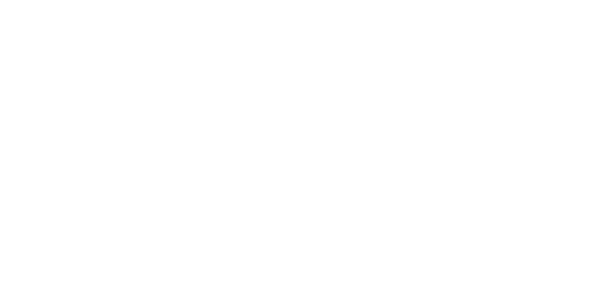
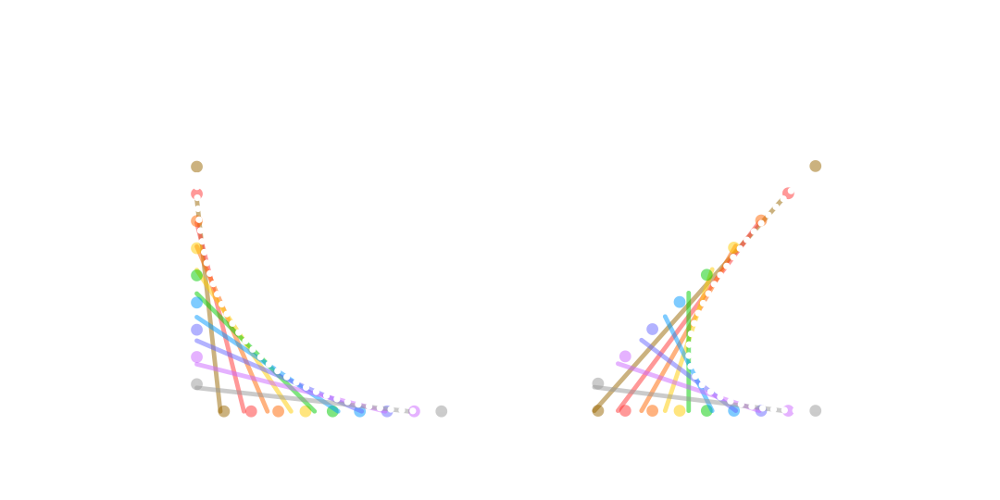

# Problem Definition

## Abstract

In the following documentation I will go over several methods for procedurally computing
string art images.

> [Wikipedia Definition](https://en.wikipedia.org/wiki/String_art):
> "String art or pin and thread art, is characterized by an arrangement of colored thread strung between points to form geometric patterns or representational designs.
> Thread, wire, or string is wound around a grid of nails hammered into a velvet-covered wooden board."

Straight lines are formed by the string, which combined can create a visible image. 

Normally, artists would have to intuitively find an arrangement of the string to recreate a given image. That's why, I will
tackle the problem of finding a mathematical way of computing string art, thus automating the process.

## Introduction

As described above, string art is a technique to create a visual effect by manipulating thread or string
to form patterns and reproduce an image.

The goal is to digitally replicate this effect from an input image. We have to keep in mind,
that there are a multitude of ways to achieve this, and for every approach I will go over the more intricate details of each one.
For example, I will begin with a black-and-white image and then explore methods for creating full-spectrum RGB versions as well.



> An image to illustrate each individual component of the string art process.

The definition of string art I addressed earlier will not be fully applied when creating it digitally.
That is because our goal is to replicate the visual effect of the traditional way, and want to get as close as possible to the original image,
without the physical constraints of a continuous thread or string.


> An image to illustrate different string arrangement types: continuous versus fragmented.

Although the strings form straight lines, the slight variations in the angles and positions at which 
they intersect create the illusion of Bézier curves.

This technique is similar to how shapes are defined in .svg files, enabling us to recreate any shape we desire. In this way, the entire process becomes possible.



> An image to illustrate Quadratic Bézier Curves obtained from strings

## Problem Formulation

The input of our pipeline will be a normal image, which we will initially convert to grayscale to simplify the process.

We can define the following:

```math
y = \text{The initial grayscale image}
```
```math
m = \text{The number of rows and columns in the image, the image is square (m, m)}
```
```math
b = \text{The flattened row-wise version of the image. } b \in \mathbb{R}^{m^2}
```
```math
N = \text{The Number of pegs used}
```
```math
n = {N \choose 2} \text{, the number of lines}
```

```math
A_i = \text{A matrix representing the } i \text{-th line drawn on the canvas}
```
```math
A = \text{For each } A_i \text{, the corresponding column is the flattened row-wise version of } A_i. \space A \in \mathbb{R}^{m^2, \space n}
```

Thus, the goal of our process is to minimize:

```math
\min{\| A \cdot x - b \|^2}
```
