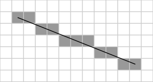

# Least Squares (LS)

## Terminology

The **Least Squares** approach minimizes the aforementioned function:

```math
\min{\| M \cdot X - Y \|}_2^2
```

by the vector x such that the l<sup>2</sup>-norm between the ground truth image (initial image) and
the computed image (the one calculated using this algorithm) is minimum.

Each column in the matrix `M` represents the flattened row-wise matrix of an image where a line is drawn connecting two pegs.
Currently, `M` is stored as a **dense** matrix, but a **sparse** representation will also be explored and benchmarked for comparison.

The vector `X` contains values between 0 and 1, indicating the intensity or extent to which each line is drawn.

The vector `Y` is the flattened row-wise representation of the initial image.

## Peg Placement

As for the placing of the pegs in a circular shape at equidistant space between them, I used the parametric
equation for a circle. 

```math
\text{For a circle centered in } (x_c, y_c) \text{ with radius } r \text{ and } n \text{ pegs}:
```
```math
x_k = x_c + r \cdot \cos(\frac{2 \pi k}{n})
```
```math
y_k = y_c + r \cdot \sin(\frac{2 \pi k}{n})
```
```math
\text{for } k = 0, 1, 2, ..., n-1
```

## Bresenham

To draw each line in the matrix, the Bresenham algorithm was used, determining the points needed to be
selected between two chosen pegs in order to have a close representation of a straight drawn line.

## Output Image

After solving the system for `X`, we can generate the output image using:

```math
O = MX
```

## Implementation

The least squares solution can be implemented using two methods:

### 1. Dense Matrix Representation

In this approach, the matrix `M` is represented as a dense (full) matrix with dimensions:

```math
M \in \mathbb{R}^{m \cdot n, \space l}
```

While this is simpler and easier to understand, this representation is more computationally expensive for larger matrices due to the fact that each element, including zeros, is explicitly stored. In consequence, this leads to higher memory usage and increased computational time.

### 2. Sparse Matrix Representation

The second approach uses a **sparse matrix** representation.

Knowing the fact that our column vectors in the dense matrix are a representation of a flattened matrix with just one line drawn in it, we can say that the matrix is a **sparse matrix**, meaning most elements are zero.

For example, at most `max(m,n)` elements of the matrix are set to non-zero values, as determined by the Bresenham line algorithm. See the illustration below:



In the example above, where `m = 5, n = 11` the line drawn results in exactly `11` non-zero elements.

In this case, **least squares algorithms** have special implementations to take advantage of the sparse matrix structure. They work faster and use less memory, because they only process the non-zero elements.

This results in a matrix with dimensions `3 * nz`, where `nz` represents the number of non-zero elements. The information is stored in the following format:

- One vector representing the row indices
- One vector representing the column indices
- One vector representing the values

The relationship thus becomes: `data[i] = matrix[row[i]][column[i]]`.

> [!NOTE]
> Both the dense and sparse methods have been implemented.

## Observations

However, since some values fall outside the `[0, 1]` range, I applied clipping to validate the constraint.
Additionally, these values are **real** numbers, meaning `X` represents an intensity vector rather than a binary one.

We could also experiment with allowing negative values, which would correspond to subtracting a line, 
or **scaling** the values to fit within `[0, 1]` instead of **clipping**. 

However, keep in mind that subtracting an edge violates physical constraints and is only possible digitally.