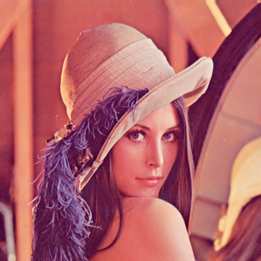
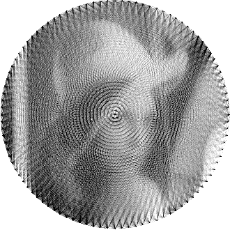
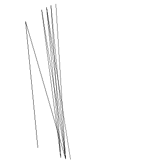
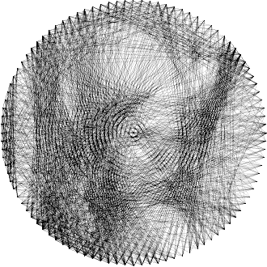
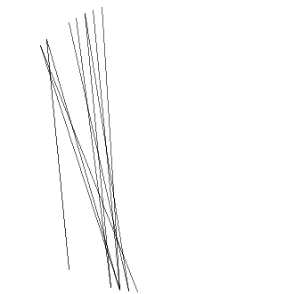

# Benchmark and Analysis

## Target Image

> Target Image. Grayscale was used

## Output Images

 

> Least Squares Dense (left) and Sparse (right) Methods

> Orthogonal  Matching Pursuit
 
 

> Matching Pursuit with Random Heuristic (left) and Dot Product Heuristic (right)

## Visual Observations

Right off the bat we can see that the best results to the human eye are clearly the ones using the **Least Squares** approach. That is because they utilize all possible lines and adjust their intensity between 0 (white) and 1 (black) (**NOTE**: values are inverted so we can draw black lines rather than white ones. In computer graphics 0 represents black and 1 white).

On the other hand, the **Matching Pursuit Greedy** approaches, which select a limited number of lines (in this case, 1000), produce less smooth reconstructions. The random heuristic tends to be more chaotic, choosing lines from various regions of the image. In contrast, the dot product heuristic focuses on certain areas, leading to more localized but less varied results.

Increasing the number of selected lines in the **Matching Pursuit Greedy** approaches could improve their results, but the trade-off lies in the **high computational cost**. 

The **Orthogonal Matching Pursuit** method seems to strike a balance between the random heuristic and dot product heuristic of the greedy alternative.

## Difference Images

 

The difference images highlight the discrepancy between the target and each method’s output. As we can observe, the difference images look quite the same to the output images, that is because our target image has more shades of gray and the algorithm can only pick one consistent color along each line. The best effect can be seen on the second to last image (**Greedy** approach with **Random** heuristic).

Results could be improved by choosing another target image with a higher contrast, or enabling some image preprocessing (such as contrast adjustment or compressing/expanding the brightness range) on it before. 

The **Least Squares** approaches produced the smallest errors. The experiment should also be tried with an increased number of lines for the **Matching Pursuit** approaches as it can increase accuracy.
And another interesting experiment would be to allow the subtracting of edges. This experiment works for both approaches.

## Time Taken for Computation

In terms of computational time, the **Least Squares Sparse** approach is the most efficient, completing in just a few seconds. The **Least Squares Dense** approach, while taking more time, remains relatively fast compared to the greedy algorithms.

The **Matching Pursuit (Greedy)** methods, particularly the **Random Heuristic**, exhibit the longest computation times. This is due to the fact that they must repeatedly compute the least squares solution for each potential line and select the one that minimizes the error at each step. We can see that the **Dot Product Heuristic** is a couple of minutes faster than the **Random Heuristic**. This is because the dot product between the possible lines and our target image is only computed once, whereas the random selection process is computed every time we calculate the error (at each step and for each potential line).

The **Orthogonal Matching Pursuit** method seems to be faster than the dense approach of the least squares method, but still doesn't come close to the sparse approach.

## Peak Memory Usage

Memory usage provides an interesting insight into the efficiency of the algorithms. All methods except the **Least Squares Dense** approach utilize less than `1GB` of memory. 

The **Dense** method requires significantly more memory because it needs to store a large matrix of size: `m = 108.900, n = 4.950`. In contrast, the **Least Squares Sparse** method only needs to store non-zero elements, representing a more memory-efficient solution. And the **Matching Pursuit** approaches hold at maximum a matrix of size: `m = 108.900, n = 1000`.

## Observations

- **RMS (Root Mean Square)** error does not always correlate with subjective image quality. While an image with a lower **RMS** error may appear mathematically more accurate, it may not necessarily look better to the human eye.

- The **Least Squares** methods are the most accurate in terms of both image quality and error.

## Conclusion

This analysis highlights the trade-offs between accuracy, computational time, and memory efficiency.

Without a doubt the current best method is the **Least Squares Sparse** approach. It stands out for several reasons:

- **Lowest computation time:** It is the most efficient in terms of time, completing the task in just a few seconds.
- **Lowest memory usage:** The **Sparse** method is memory-efficient, as it only stores non-zero elements, making it ideal for larger problems.
- **Lowest RMS:** It delivers the smallest RMS error, demonstrating that it can accurately approximate the target image.
- **Best subjective image quality:** In terms of subjective image quality, the **Sparse** method also yields better results providing a more accurate reconstruction for the human eye.

Overall, the **Least Squares Sparse** approach achieves an optimal balance between performance and efficiency, making it the most reliable solution in this benchmark.