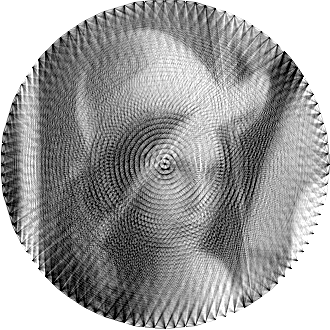
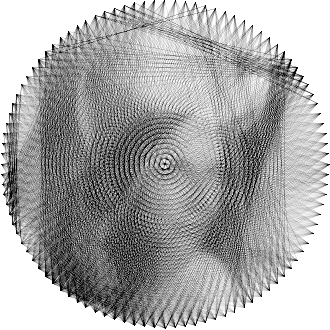
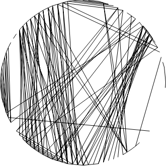

# Benchmark and Analysis

## Target Image

> Target Image. Grayscale was used

## Output Images

 

> Least Squares Dense (left) and Sparse (right) Methods

> Orthogonal  Matching Pursuit
 
 

> Matching Pursuit with Random Heuristic (left) and Dot Product Heuristic (right)

 

> Binary Projection Least Squares with CVXOPT solver (left) and Scipy solver (right)

## Visual Observations

Right off the bat we can see that the best results to the human eye are clearly the ones using the **Least Squares** approach. That is because they utilize all possible lines and adjust their intensity between 0 (white) and 1 (black) (**NOTE**: values are inverted so we can draw black lines rather than white ones. In computer graphics 0 represents black and 1 white).

On the other hand, the **Matching Pursuit Greedy** approaches, which select a limited number of lines (in this case, 1000), produce less smooth reconstructions. The random heuristic tends to be more chaotic, choosing lines from various regions of the image. In contrast, the dot product heuristic focuses on certain areas, leading to more localized but less varied results.

Increasing the number of selected lines in the **Matching Pursuit Greedy** approaches could improve their results, but the trade-off lies in the **high computational cost**. 

The **Orthogonal Matching Pursuit** method seems to strike a balance between the random heuristic and dot product heuristic of the greedy alternative.

Both **Binary Projection LS** methods converged early, around the 50th iteration, as they were unable to further reduce the residual due to the binary nature of line selection. While the overall shape of the reconstruction somewhat resembles the original image, the result lacks intelligibility. To improve the outcome, the simulation should be rerun using another loss function (one taking into account the downsampling operator).

## Difference Images

 

The difference images highlight the discrepancy between the target and each method’s output.

The **Least Squares** approaches produced the smallest errors, however the matching pursuit were not so far off. The only noticeably inaccurate results were produced by the Binary Projection LS methods, which is expected.

## Time Taken for Computation

In terms of computational time, the **Least Squares Sparse** approach is the most efficient, completing in just a few seconds. The **Least Squares Dense** approach, while taking more time (~3 minutes), remains relatively fast compared to the greedy algorithms.

The **Matching Pursuit (Greedy)** methods, particularly the **Random Heuristic**, exhibit longer computation times. This is due to the fact that they must repeatedly compute the least squares solution for each potential line and select the one that minimizes the error at each step. We can see that the **Dot Product Heuristic** is almost twice as fast as the **Random Heuristic**. This is because the dot product between the possible lines and our target image is only computed once, whereas the random selection process is computed every time we calculate the error (at each step and for each potential line).

The **Orthogonal Matching Pursuit** method seems to be faster than the dense approach of the least squares method, but still doesn't come close to the sparse approach.

The longest computation time goes to the **Binary Projection LS** method. This is because at each iteration, we compute the LS solution and select the top `k` lines, then subtract them from the residual. This differs from the **Matching Pursuit** methods, which build the matrix from scratch and iteratively add one column based on a heuristic until the desired number of lines is selected. In contrast, here we start with all the lines and iteratively select the best `k`, redoing the process each time.

## Peak Memory Usage

Memory usage provides an interesting insight into the efficiency of the algorithms.

The **Dense** method requires significantly more memory because it needs to store a large matrix of size: `m = 108.900, n = 4.950`. In contrast, the **Least Squares Sparse** method only needs to store non-zero elements, representing a more memory-efficient solution. And the **Matching Pursuit** approaches hold at maximum a matrix of size: `m = 108.900, n = 1000`.

## Residual Over Iterations

> Residual History

> Normalized Residual History (better for visualizing the decline trend)

The two **Least Squares** methods appear as single dots, as they provide a complete solution in one step and do not involve iterative updates.

We can observe that the **Binary Projection LS** methods stop early, around residual value **~168**, while the other methods continue to decrease their residuals, trending toward **120**.

Interestingly, the greedy method with the **dot-product heuristic** for **Matching Pursuit** performs worse than the **random heuristic** and the **orthogonal** selection strategies.

## Observations

- **RMS (Root Mean Square)** error does not always correlate with subjective image quality. While an image with a lower **RMS** error may appear mathematically more accurate, it may not necessarily look better to the human eye.

- The **Least Squares** methods are the most accurate in terms of both image quality and error.

## Conclusion

This analysis highlights the trade-offs between accuracy, computational time, and memory efficiency.

Without a doubt the current best method is the **Least Squares Sparse** approach. It stands out for several reasons:

- **Lowest computation time:** It is the most efficient in terms of time, completing the task in just a few seconds.
- **Lowest memory usage:** The **Sparse** method is memory-efficient, as it only stores non-zero elements, making it ideal for larger problems.
- **Lowest RMS:** It delivers the smallest RMS error, demonstrating that it can accurately approximate the target image.
- **Best subjective image quality:** In terms of subjective image quality, the **Sparse** method also yields better results providing a more accurate reconstruction for the human eye.

Overall, the **Least Squares Sparse** approach achieves an optimal balance between performance and efficiency, making it the most reliable solution in this benchmark.