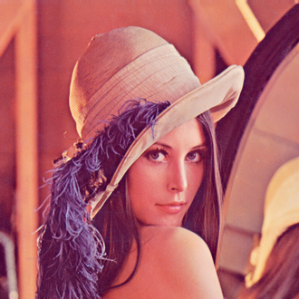

# Binary Least Squares

## Motivation

In the original least squares approach, the solution vector `x` is unconstrained, meaning some values can fall outside the `[0, 1]` interval (e.g., negative values). To address this, I initially used the `clip` function to restrict `x` within `[0, 1]`. However, an alternative approach is to round `x` values to either `0` or `1`, based on the number of lines the user wants to draw.

For example, if the user specifies `1000` lines, I take the top `1000` values of `x` in descending order, set them to `1`, and set the rest to `0`. This ensures that only the most significant edges are selected.

## Result

Previously, the post-processing function was defined as:

```python
solution = A @ x
solution = np.clip(np.reshape(solution, shape=self.shape), a_min=0, a_max=1)
solution = 1 - solution
solution = np.multiply(solution, 255).astype(np.uint8)
solution = crop_image(solution, self.image_mode)
```

> This method allows edges to be selected even if they have negative values.

I modified it to:

```python
l = 1000
value = x[np.argsort(x)[-l]]

xp = x.copy()
xp[xp < value] = 0
xp = np.clip(xp, a_min=0, a_max=1)

solution = A @ xp
solution = np.clip(np.reshape(solution, shape=shape), a_min=0, a_max=1)
solution = 1 - solution
solution = np.multiply(solution, 255).astype(np.uint8)
solution = crop_image(solution, image_mode)
```

> This approach pre-processes the edge factors before multiplication with matrix `A`.

### Output

The modified method produced the following result:


## Issue with This Approach

The resulting image does not resemble the input:



### Why Does This Happen?

The least squares method approaches this problem by selecting edges lying on the boundary of the shape with high positive values, while assigning near-zero or negative values to the others. When computing the `A @ x` product, the edges drawn toward the center of the shape counteract the ones on the boundary, minimizing the total error. 

This method works when all edges are included. However, when only a subset is selected using the rounding method, the balance is lost, and the input image cannot be accurately reproduced.

## Solution: Linear Programming

To overcome this issue, we need to implement **Linear Programming** with constraints that explicitly restrict `x` values to the `[0,1]` interval. This forces the algorithm to make selections without relying on negative or out-of-range values, thus forcing the algorithm to no longer choose the edges on the boundary of the shape.

See the [Implemented Solution](./06_linear_programming.md) for details on how Linear Programming is applied to solve this problem effectively.
