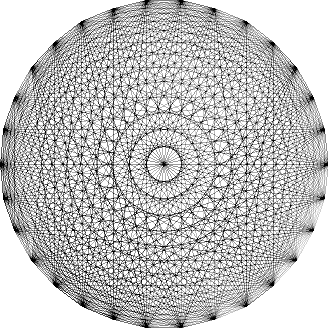

# Linear Programming

## Problem Formulation

Linear programming (LP) aims to optimize an objective function subject to linear constraints. In this case, we define the LP problem as follows:

```math
\text{Find a vector: } x
```
```math
\text{That minimizes the objective function: } \sum_{i=1}^{m \cdot m} r_i
```
```math
\text{Where: } r = b - Ax
```
```math
\text{Subject to: }
```
```math
Ax \ge b
```
```math
x \ge 0
```

## Output

The following image illustrates the output of the linear programming solution:



> Generated for 30 pegs. Computation time: 2 minutes 32 seconds.

## Performance Bottlenecks

The current approach, implemented using the `PuLP` library, becomes increasingly inefficient as the number of pegs increases. The computation time grows exponentially due to the way constraints scale.

For `30` pegs, a computation time of 2 minutes and 32 seconds is manageable. However, even a small increase in the number of pegs leads to a way higher rise in compute time. (e.g. for `100` pegs it took greater than 2 hours and it didn't even finish)

Given **n_pegs**, the number of **lines**:
```math
n \text{ is determinde as} = \frac{N (N - 1)}{2}
```

For an image of size **330x330 pixels**, the matrix representation results in the following growth pattern:

| n_pegs | Lines (n) | Size of A      | No. Elements |
|--------|-----------|----------------|--------------|
| 30     | 435       | 108.900 × 435  | 47.371.500   |
| 40     | 780       | 108.900 × 780  | 84.942.000   |
| 100    | 4.950     | 108.900 × 4950 | 539.055.000  |

Although increasing from `30` to `100` pegs is only a **3.33×** increase, the number of elements grows **11.37×** due to the polynomial nature of `n`. Additionally, the simulation of the `Ax = b` constraint further increases complexity.

Using `PuLP`'s sparse matrix representation, we observe the following real model complexities:

| n_pegs | Rows    | Columns | Elements  |
|--------|---------|---------|-----------|
| 30     | 217.800 | 109.335 | 387.742   |
| 40     | 217.800 | 109.680 | 519.462   |
| 100    | 217.800 | 113.850 | 2.106.582 |

## **Conclusion**

The current approach does not scale efficiently due to the rapid growth of constraints and matrix size. Alternative optimization techniques or solver libraries like: `scipy.optimize.lin_prog` or `scipy.optimize.nnls` may be required to handle larger values of **n_pegs** effectively.

> See solution using `scipy.optimize.lsq_linear`: [Linear Least Squares Solution](./07_linear_least_squares.md)