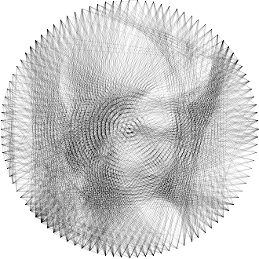

# Linear Least Squares (LLS)

## Problem Formulation

The linear least squares method follows the same principles as [standard least squares](./02_least_squares.md) but introduces an additional constraint that bounds the `x` variables within a specified interval. In this case, I impose the constraint: `(0, ∞)`.

## Results

### Output

> Output generated using Linear Least Squares with `100` pegs.

The computation took approximately **30 seconds** and reached a peak memory usage of **~200MB**.

By enforcing the constraint, we successfully eliminated the issue of selecting lines on the edge of the circle, and the `x` values remain non-negative.

## Conclusion

While this approach is slower than standard sparse least squares, it performs better than dense least squares and the other greedy algorithms. Additionally, it effectively mitigates the issue of negative line values, leading to the possibility of "selecting" the most important lines to draw.
