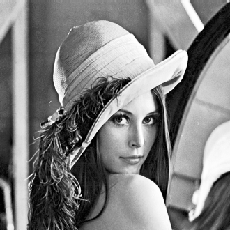
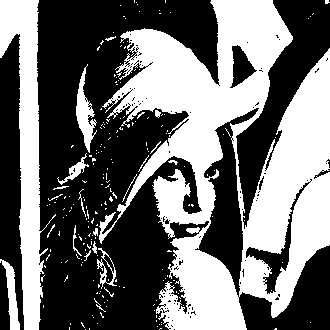
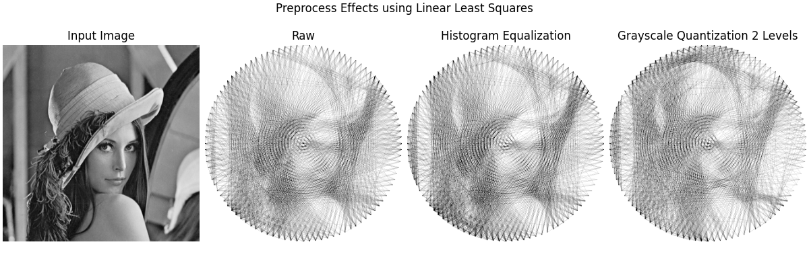
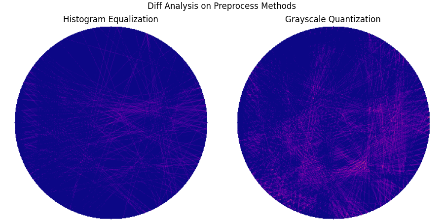
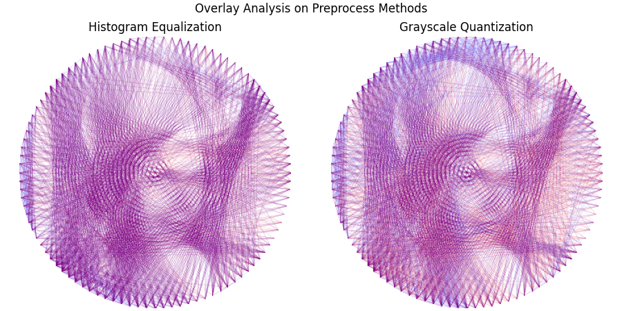
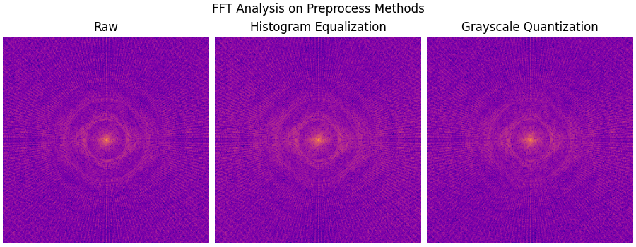

# Image Preprocessing

Some images, like the Lena input image, often have a dull or muted tone, resulting in a grayscale appearance that hinders accurate line detection by algorithms. 

Those methods shouldn't depend on some magic variable and should have the same tonality for every image.

To address this, I explored two preprocessing methods that aim to standardize the tone of images. These methods are consistent, meaning they enhance contrast for bland images while reducing it for overly dark ones, placing every image at a similar tonal level.

## Methods

### Histogram Equalization

This method works by distributing the histogram of an image evenly across the entire spectrum, effectively 'equalizing' it.

Algorithm steps:
    
1. Calculate the histogram `H` for the source image.
2. Normalize the histogram so that the sum of histogram bins is 255.
3. Compute the cumulative sum to get `H'`.
4. Transform the image using `H'` as a look-up table: `dst(x, y) = H'(src(x, y))`

For more details, check the official [OpenCV tutorial](https://docs.opencv.org/4.x/d4/d1b/tutorial_histogram_equalization.html).


> Lena input image



> Lena after Hisogram Equalization

### Grayscale Quantization

Grayscale Quantization reduces the number of intensity levels in an image, effectively converting a continuous grayscale spectrum into a discrete, thresholded one.

Algorithm steps:

```math
Q(x) = \lfloor \frac{x}{\Delta} \rfloor * \Delta + \frac{\Delta}{2}
```

```math
\Delta = \frac{255}{L}
```

```math
L = \text{Desired Intensity Levels}
```

For more information, visit the [Wikipedia page](https://en.wikipedia.org/wiki/Quantization_(image_processing)#Grayscale_quantization).


> Lena input image



> Lena after Grayscale Quantization

## Side by Side Comparison


## Analysis

### Result Impact



Grayscale Quantization, being more aggressive, simplifies shape detection due to the binary nature of its output. In contrast, Histogram Equalization offers a subtler adjustment, retaining more image details.

### Difference Analysis



Grayscale Quantization shows a more pronounced difference compared to the raw output, especially around the outer face areas, while Histogram Equalization maintains finer details.

### Overlay Analysis



The raw output is marked in red, while the preprocessed results appear in blue. Areas where both overlap are shown in purple. Notably, Grayscale Quantization exhibits more unique blue lines, particularly at the top of the image.

### Fast Fourier Transform Analysis



Despite the preprocessing differences, the frequency spectrum after FFT remains consistent across all methods, indicating that tone adjustments do not affect the frequency content.