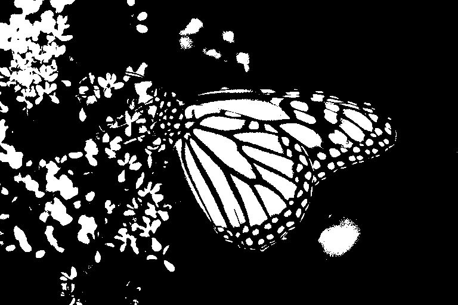
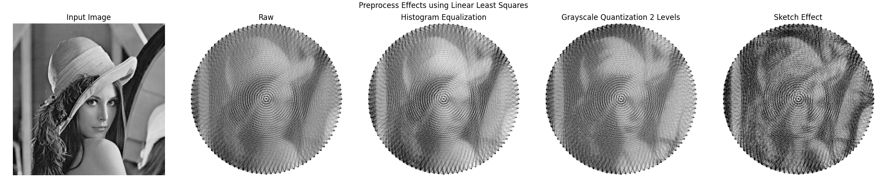
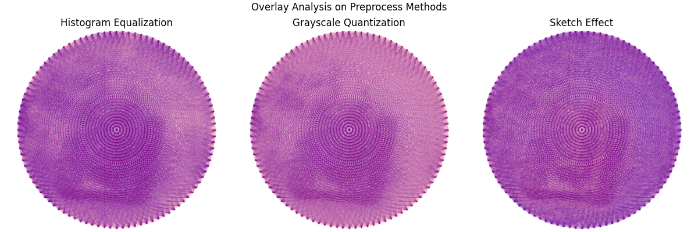
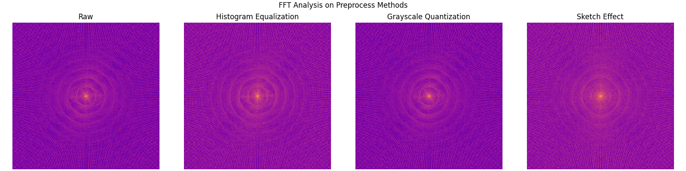

# Image Preprocessing

Some images, like the Lena input image, often have a dull or muted tone, resulting in a grayscale appearance that hinders accurate line detection by algorithms. 

Those methods shouldn't depend on some magic variable and should have the same tonality for every image.

To address this, I explored two preprocessing methods that aim to standardize the tone of images. These methods are consistent, meaning they enhance contrast for bland images while reducing it for overly dark ones, placing every image at a similar tonal level.

## Methods

### Histogram Equalization

This method works by distributing the histogram of an image evenly across the entire spectrum, effectively 'equalizing' it.

Algorithm steps:
    
1. Calculate the histogram `H` for the source image.
2. Normalize the histogram so that the sum of histogram bins is 255.
3. Compute the cumulative sum to get `H'`.
4. Transform the image using `H'` as a look-up table: `dst(x, y) = H'(src(x, y))`

For more details, check the official [OpenCV tutorial](https://docs.opencv.org/4.x/d4/d1b/tutorial_histogram_equalization.html).


> Input Images


> Input Images after Histogram Equalization

### Grayscale Quantization

Grayscale Quantization reduces the number of intensity levels in an image, effectively converting a continuous grayscale spectrum into a discrete, thresholded one.

Algorithm steps:

```math
Q(x) = \lfloor \frac{x}{\Delta} \rfloor * \Delta + \frac{\Delta}{2}
```

```math
\Delta = \frac{255}{L}
```

```math
L = \text{Desired Intensity Levels}
```

For more information, visit the [Wikipedia page](https://en.wikipedia.org/wiki/Quantization_(image_processing)#Grayscale_quantization).


> Input Images




> Input Images after Grayscale Quantization

### Sketch Effect

This preprocessing method simulates a **pencil sketch** from a grayscale image using a series of image transformations.

Algorithm steps:
    
1. Invert the input image.
2. Apply Gaussian blur to the inverted image.
3. Invert the blurred result.
4. Perform pixel-wise division between the original image and the inverted blurred image (this mimics a "color dodge" blend).
5. Apply histogram equalization to enhance contrast in the final output.

For more details, check this [Medium Article](https://medium.com/@Kavya2099/image-to-pencil-sketch-using-opencv-ec3568443c5e).


> Input Images


> Input Images after Sketch Effect

## Side by Side Comparison

### Lena


### Airplane


### Butterfly


### Tank


### Teddybear


## Analysis

### Result Impact




**Grayscale Quantization**, being more aggressive, simplifies shape detection due to the binary nature of its output. In contrast, **Histogram Equalization** offers a subtler adjustment, retaining more image details.

The **Sketch Effect** introduces enhanced edge details and produces visually rich outputs. As observed in the results for images like lena, airplane, butterfly, and tank, the sketch effect highlights contours effectively.

However, this enhancement can also introduce **drawbacks**. In the airplane and tank images, for instance, the primary subject sometimes blends with the background due to increased noise and amplified gradients, thus making it harder to isolate the main object.

### Difference Analysis


**Grayscale Quantization** shows a more pronounced difference compared to the raw output, especially around the outer face areas, while **Histogram Equalization** maintains finer details.

The most aggressive transformation is introduced by the **Sketch Effect**. It significantly alters the image by amplifying both edges and noise. While it promotes finer detail visibility, it also increases background interference, making it both the most visually striking and the most distortion-prone among the preprocessing methods.

### Overlay Analysis





The raw output is marked in red, while the preprocessed results appear in blue. Areas where both overlap are shown in purple.

A notable observation is that the **Sketch Effect** produces significantly more unique blue lines, especially in background areas. This suggests that the sketch preprocessing introduces additional details and noise that were not present in the raw solution, highlighting its more aggressive transformation.

### Fast Fourier Transform Analysis





Despite the preprocessing differences, the frequency spectrum after FFT remains consistent across all methods, indicating that tone adjustments do not affect the frequency content.
