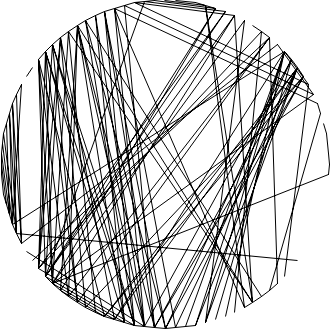

# Binary Projection Least Squares

This module solves binary-constrained least squares problems using a greedy projection approach with **quadratic programming (QP)** via `cvxopt`.

## Terminology

```math
\text{A matrix: } A \in \mathbb{R}^{m \times n}
```

```math
\text{A target vector: } b \in \mathbb{R}^{m}
```

I aim to solve the constrained least squares problem:

Where:

- x is constrained to lie in the unit hypercube `[0,1]^n`
- I then greedily project top-`k` variables to binary values (fix to 1), iteratively improving the approximation

## Method Overview

The algorithm iteratively:

1. Solves a bounded least squares problem:

```math
\min{\| A \cdot x - b \|}^2 \text{ subject to } x \in [0,1]^n
```

using quadratic programming.

2. Fixes the top-k variables with the highest values in x to 1.

3. Adjusts the problem by subtracting the effect of those fixed variables from b, then repeats.

4. At the end, all remaining variables are set to 0.

## Quadratic Programming Formulation

I reformulate the least squares problem as a **quadratic program (QP)** in the standard form:

```math
\min_{x} \frac{1}{2} x^TPx + q^Tx \text{ subject to } Gx \leq h
```

For least squares, I expand the squared norm:

```math
\| A \cdot x - b \|^2 = (Ax - b)(Ax - b) = x^TA^TAx - 2b^TAx + b^Tb 
```

Since `b^T*b` is constant, the QP form becomes:

```math
P = 2A^TA
```

```math
q = -2A^Tb
```

## Box Constraints

I encode this in matrix form as:

```math
x_i \geq 0 = -x_i \leq 0
```

```math
x_i \leq 1
```

So I define:

```math
G = \begin{bmatrix}
-I\\
I
\end{bmatrix}
```

```math
h = \begin{bmatrix}
0\\
1
\end{bmatrix}
```

Where:

```math
I \in \mathbb{R}^{n \times n} \text{ is the identity matrix}
```

```math
Gx \leq h \text{ now captures both bounds}
```

In code:

```python
G = np.vstack((-np.eye(n), np.eye(n)))
h = np.hstack((np.zeros(n), np.ones(n)))
```

## Greedy Binary Projection Loop

We want to solve:

```math
\min{\| A \cdot x - b \|}^2 \text{ subject to } x \in \{0,1\}^n
```

Which is **combinatorially hard**, since it involves a binary vector `x`. So instead, I use a **relax-and-round** strategy:

### 1. Relax the Problem 

We relax the binary constraint to:

```math
x \in [0,1]^n
```

This lets us solve a continuous least-squares problem efficiently.

### 2. Solve for the Best Continuous Approximation

We solve:

```math
\min{\| A \cdot x - b \|}^2 \text{ subject to } x \in [0,1]^n
```

This gives us a vector `x` with values between 0 and 1. It’s not binary, but it shows which variables are most useful in minimizing the error.

### 3. Identify the Most Useful Variables

We then **rank the entries** of `x` by their values. High values suggest that setting those components to 1 helps reduce the error the most.

So I pick the **top-k** largest values in `x` and fix those variables to 1.

### 4. Adjust the Problem

Now that some variables are fixed to 1:

- We calculate their contribution:

```math
A_1 \cdot 1
```

- We subtract that from `b`, since their effect is already "paid for"
- The new target is:

```math
b_{adjusted} = b - A_1 \cdot 1
```

This leaves a **reduced problem** for the remaining (unfixed) variables.

### 5. Repeat

We repeat:

- Solve the new relaxed problem on the **unfixed variables**
- Fix another **top-k** to 1
- Update the adjusted `b`

This **iteratively reduces the error** while **greedily building** a binary solution.

### 6. Finalize

Once all variables are either fixed or I've reached the iteration limit:

- Set the **unfixed variables to 0**
- Return the resulting **binary vector**

## Output

At the end of the iterative loop:

- The result `x` is a **binary vector** that approximately minimizes the least squares error

## Results




> CVXOPT Result (left) and `scipy.optimize.lsq_linear` result (right)


> Difference Images


> Time Usage


> Memory Usage


> Residual Over Iterations

The SciPy solver achieves a more efficient reduction in the residual and converges to the same final residual as CVXOPT, but it requires more computation time to do so.

## Bibliography

- [**Boyd & Vandenberghe — Convex Optimization, Chapter 4 (Free online)**](https://web.stanford.edu/~boyd/cvxbook/)
- [**CVXOPT User Guide**](https://cvxopt.org/userguide/coneprog.html#quadratic-programming)