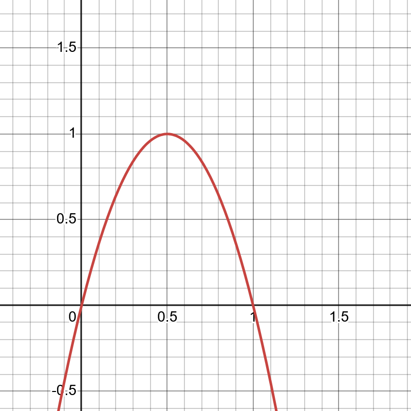
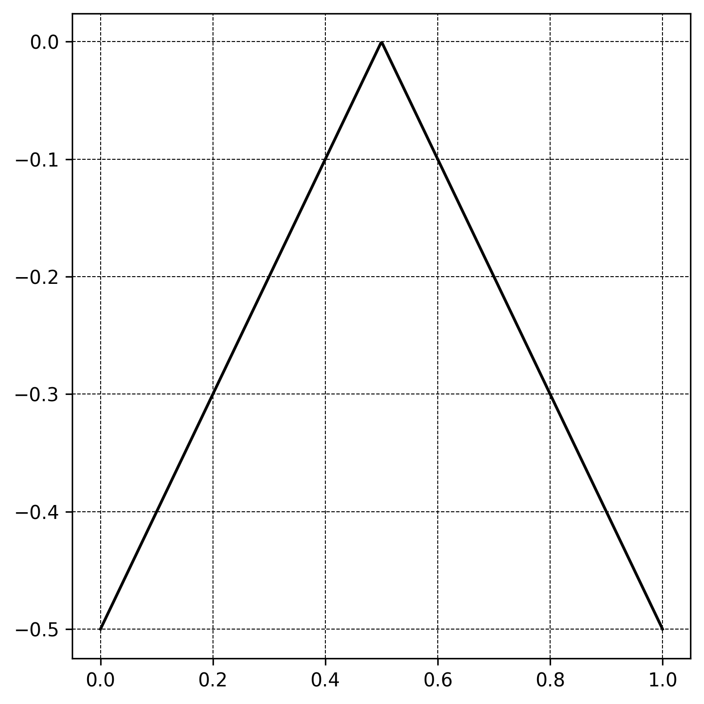
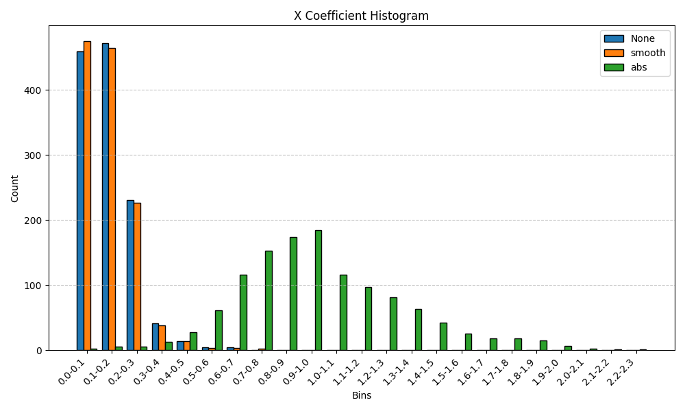
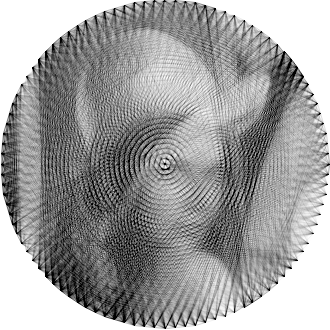
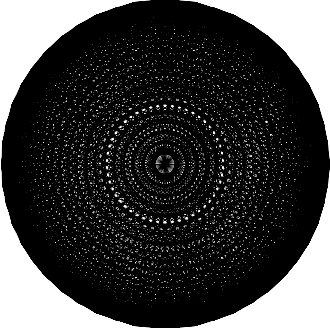

# Least Squares Regularized

Considering our previous [Quadratic Problem Formulation](./11_binary_projection_ls.md#quadratic-programming-formulation), I can add regularization terms to the CVXOPT solver in order to push values toward 0 or 1. This is useful when I want to encourage binary-like solutions without explicitly constraining the problem to binary values.

The base optimization problem is:

```math
\min_{x} \frac{1}{2} x^TPx + q^Tx \text{ subject to } x \in [0,1]^n
```

I extend this problem with two types of regularizers: **smooth** and **absolute**.

## Smooth Regularization

### Formula

```math
4x(1-x)
```



> Smooth Regularizer Graph

This regularizer promotes binary values by penalizing intermediate values in `[0,1]`. The function 4x(1−x) is zero at x=0 and x=1, and reaches its maximum at x=0.5, making it ideal for encouraging binary-like outputs.

### Modified Objective

The regularized objective becomes:

```math
\min_{x} \frac{1}{2} x^T(P - 8 \lambda I)x + (q + 4\lambda1)^Tx \text{ subject to } x \in [0,1]^n
```

This modification adjusts both the quadratic and linear terms. The scalar λ controls the strength of the regularization. A safeguard is included to ensure the matrix remains positive semi-definite by limiting:

```math
\lambda \leq \frac{\lambda_{min}(P)}{8}
```

```math
\text{where}
```

```math
P = 2A^TA
```

```math
q = -2A^Tb
```

## ABS Regularization

### Formula

```math
1 - 2 \left| x - 0.5 \right|
```

This simplifies to:

```math
- \left| x - 0.5 \right|
```

The term `|x−0.5|` is convex, but its negation is concave. Including it in the objective breaks the convexity of the quadratic program (QP), making the problem non-convex.



> ABS Regularizer Graph

### Reformulation

To express the absolute value in a quadratic program, I introduce auxiliary variables:

```math
t_i \geq \left| x_i - 0.5 \right|
```

And optimize over:

```math
z = \left[ x; t \right] \in \mathbb{R}^{2n}
```

### Modified Objective

```math
\min_{x, t} \frac{1}{2} x^TPx + q^Tx - \lambda \sum_i{t_i} \text{ subject to } x \in [0,1]^n
```

### Constraints

The constraints ensure valid bounds on x and encode:

```math
t_i \geq \left| x_i - 0.5 \right|
```

```math
0 \leq x \leq 1
```

```math
t \geq x - 0.5
```

```math
t \geq -x + 0.5
```

These are incorporated into the QP using inequality constraints on the concatenated variable `z = [x;t]`

## X Coefficient Histogram



The **Smooth** regularizer closely resembles the behavior of having no regularization, especially when the regularization strength λ is set very low. This is often necessary to preserve the **positive semi-definite (PSD)** property of the QP matrix, which can be violated by stronger smoothness penalties.

In contrast, the **Absolute (ABS)** regularizer does succeed in pushing the `x` values toward 1, but it requires a very large regularization weight (λ=5000) to have this effect. However, this high value also causes violations of the imposed box constraints.

## Results





Comparison of solutions: no regularization (left), smooth regularization (center), and absolute regularization (right).


> Difference Images


> Time Usage


> Memory Usage

