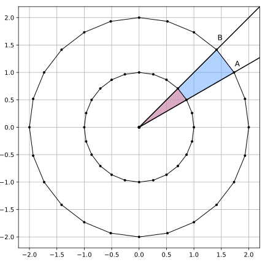

# Downsampling Operator

In the current implementation, the lines rendered are too thick, resulting in images that appear overly dark, even when only a limited number of lines are drawn. In reality, human perception interprets the **density** of string intersections as varying **shades of gray**, not absolute black. To better model this behavior, I introduce a **downsampling operator**, as described in the paper:

[**String Art: Towards Computational Fabrication of String Images**](https://www.researchgate.net/publication/322766118_String_Art_Towards_Computational_Fabrication_of_String_Images)

## Methodology

The core objective of the problem can be expressed as the following minimization:

```math
\min{\| A \cdot x - b \|^2}
```

This formulation operates at a low resolution. However, to more accurately capture the visual effect of overlapping strings, I employ **supersampling**, a technique that involves computing in a higher resolution and then **downsampling** the result.

Specifically, I upscale the matrix `A` (denoted as `A'`), compute the product `A'x`, and then apply a **downsampling operator** `D` to bring the result back to the original resolution before comparing it to the target image `b`. The new objective becomes:

```math
\min{\| D(\bar{A} \cdot x) - b \|^2}
```

where:

```math
\bar{A} = \text{is the upsampled verson of matrix A. It has the same number of columns, but more rows (higher resolution)}
```

`D` = the downsampling operator which averages **non-overlapping** blocks of size `k` x `k`

```math
D : \left[ 0, 1\right] ^ {m^2} \rightarrow \left[ 0, 1\right] ^ \frac{m^2}{k^2}
```

## Visual Intuition

The matrix `A` can be thought of as a geometric drawing:



> The inner circle represents the original low-resolution matrix `A`, while the outer circle corresponds to the upsampled matrix `A'`.

As the resolution increases, the spacing between drawn lines increases proportionally. This behavior will be further discussed in the section: [**Tuning Pegs and Block Sizes**](./15_tuning_pegs_and_block_sizes.md).