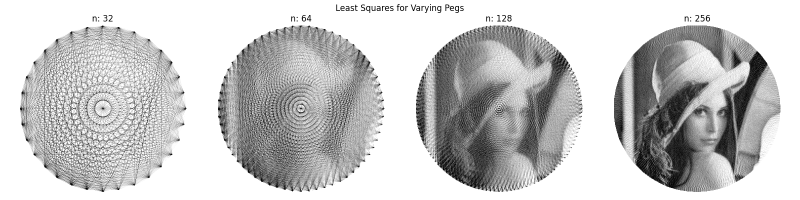
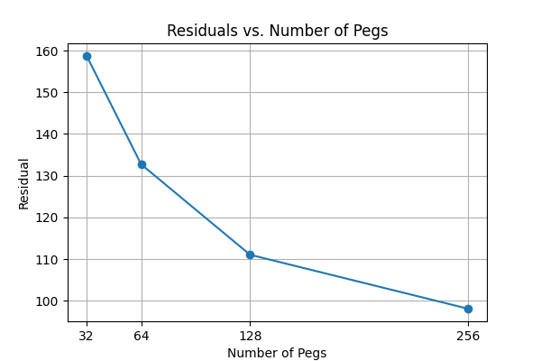
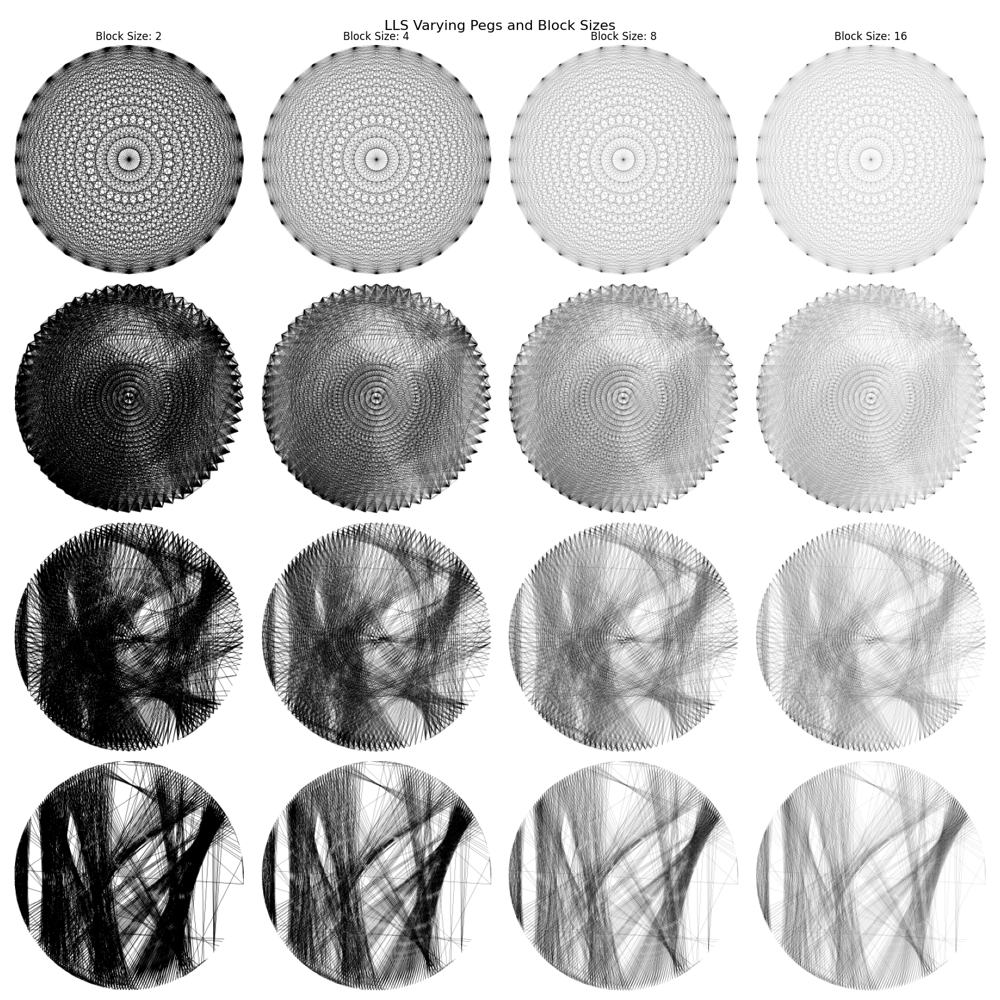
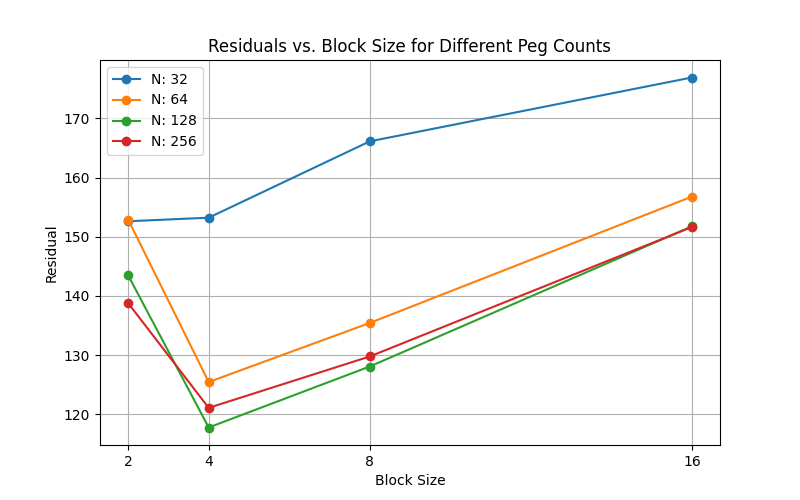
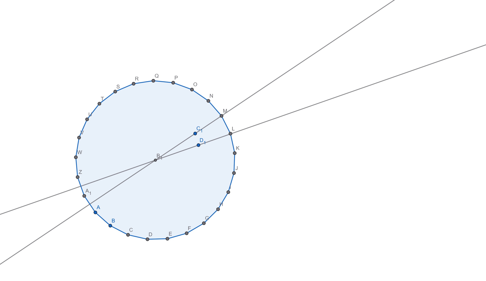
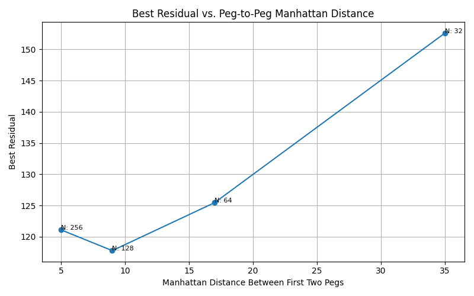

# Tuning Pegs and Block Sizes

The goal of this experiment is to determine the optimal number of pegs and block size parameters for generating high-quality string art images using different solver strategies.

## Varying the Number of Pegs – Least Squares Solver



> The image above shows Lena rendered using different numbers of pegs (denoted as n) with a least squares solver in the continuous real-valued range [-inf, inf].

From the results, it's clear that increasing the number of pegs improves image quality. However, after 256 pegs, improvements become marginal and may not justify the added complexity.



> This supports the conclusion that higher peg counts reduce reconstruction error, though with diminishing returns beyond 256 pegs.

## Varying Block Sizes - Binary Linear Least Squares Solver

To study the effect of block size, we switch to a binary solver. This is essential because when we compute at a larger resolution as stated in [**Downsampling Operator**](./14_downsampling_operator.md), white areas (thread gaps) grow more significantly than black areas (thread-covered regions), affecting visual quality.

### Image Results



> Each row represents a different peg count: `[32, 64, 128, 256]`. Each column varies the block size.

#### Observations

- Block size controls thread thickness. Increasing it makes the image more transparent.
- For a fixed number of lines and pegs, only one block size offers optimal visual clarity. This is because the change in number of pegs affects the chosen lines, besides this, choosing how many lines we draw also influences how 'dark' our image is going to be.
- Higher block sizes paired with too few lines yield overly faint images.
- A balance between contrast and coverage is crucial.

#### Best configuration found:
**128 pegs**, **block size 4**, **1000 lines**.
This setup yields sharp contrast with a clearly discernible image.

### Residual vs Block Size for Different Peg Counts



> Residuals are plotted across block sizes for each peg count.

The best residual (118.2960) occurs at 128 pegs and block size 4.

### Circle Supersampling Behaviour



> Upsampling the `A` matrix stretches the distance between threads. While angular relationships are preserved, their spatial coverage increases.

#### Implications

- Excessive upsampling reduces drawing density.
- Manhattan distance between neighboring pegs in lower-res configurations is directly proportional to the WhiteArea / BlackArea ratio.
- This gives us a geometric handle to estimate an ideal peg count.

### Residuals by Manhattan Distance and Peg Count



```
Pegs: 32, Manhattan Distance: 35, Best Residual: 152.6232, Best Block Size: 2
Pegs: 64, Manhattan Distance: 17, Best Residual: 126.5201, Best Block Size: 4
Pegs: 128, Manhattan Distance: 9, Best Residual: 118.2960, Best Block Size: 4
Pegs: 256, Manhattan Distance: 5, Best Residual: 121.5334, Best Block Size: 4
```

The best result is once again achieved with **128 pegs** and **block size 4**, highlighting a sweet spot in peg density and thread coverage.

## Deriving a Formula to Select Peg Count

I now define a formula to help estimate the optimal number of pegs. I'll fix the number of lines at 1000 and block size at 4.

### Peg Coordinates on a Circle

```math
\text{For a circle centered in } (x_c, y_c) \text{ with radius } r \text{ and } N \text{ pegs}:
```
```math
x_k = x_c + r \cdot \cos(\frac{2 \pi k}{N})
```
```math
y_k = y_c + r \cdot \sin(\frac{2 \pi k}{N})
```
```math
\text{for } k = 0, 1, 2, ..., n-1
```

The nearest first two points are:

```math
p0 = (r\cos(0), r\sin(0)) = (r, 0)
```
```math
p1 = (r\cos(\frac{2\pi}{N}), r\sin(\frac{2\pi}{N}))
```

### Manhattan Distance Between Adjacent Pegs

```math
D = \left| x_1 - x_0 \right| + \left| y_1 - y_0 \right|
```

```math
D = \left| p1_x - p0_x \right| + \left| p1_y - p0_y \right|
```

```math
D = \left| r\cos(\frac{2\pi}{N}) - r \right| + \left|  r\sin(\frac{2\pi}{N})\right|
```

```math
D = r(\left| \cos(\frac{2\pi}{N}) - 1 \right| + \left|  \sin(\frac{2\pi}{N})\right|)
```

```math
r = \frac{w}{2}, \text{where w is the width of the square image.}
```

```math
D = \frac{w}{2}(\left| \cos(\frac{2\pi}{N}) - 1 \right| + \left|  \sin(\frac{2\pi}{N})\right|)
```

### Peg Count Selection Algorithm

We can now use this function to find the peg count closest to a target Manhattan distance (experimentally found to be around **10**):

```python
w # we know w since its width of the image
d = inf
N = 0
for n in [32, 64, 128, 256, 512]:
    if abs(D(n) - 10) < abs(d - 10):
        d = D(n)
        N = n
```

The final value in `N` is the recommended number of pegs for optimal string art rendering under the given constraints.
