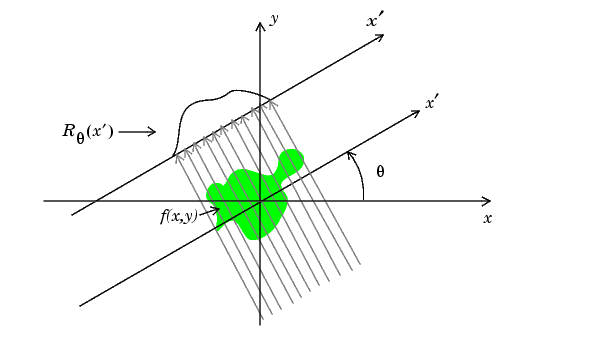
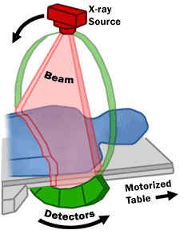
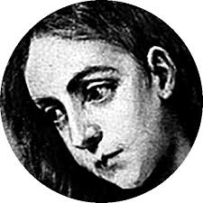
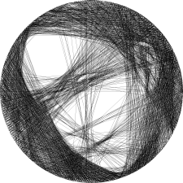

# Radon Transform

## Introduction to the Radon Transform

The Radon Transform of an image represented by `f(x, y)` can be thought of a series of line integrals through `f(x, y)`. We can express it as follows:


```math
\text{Let } L(\theta, s) = \{(x, y) \in \mathbb{R}^2 : x\cos\theta + y\sin\theta = s\} \text{ be the line integral}
```

where

```math
\theta \in \left[0, \pi\right) \text{ is the angle the line makes with the x-axis}
```
```math
s \in \left[ -r, r\right] \text{ is the signed perpendicular distance from the origin to the line, and } r \text{ is the radius of the inscribed circle within the image}
```

Then, we define:

```math
R(\theta, s) = \int_{L(\theta, s)} f(x, y)ds
```


> Radon Transform Illustration

Using the illustration above, we can think of the Radon transform like a laser beam that scans through the image. At each angle and distance, the laser measures how much of the image’s content (or density) it passes through. By collecting these measurements from different angles and positions, we get a full set of line integrals that represent the image from many perspectives. 

The Radon Transform is used in CT scans to detect foreign objects inside a patient’s body. It works by sending beams through the body from different angles and measuring the density along each beam. When the beam passes through something with a different density than the surrounding tissue, that difference is detected and identified as a foreign object.


> CT Scan Illustration

## Custom Radon Transform for String Art

In our String Art problem, the lines we draw can also be described using the same notation with `theta` and `s` as above. This means another way to solve the string art problem is to compute the Radon Transform of all possible lines across our circle and select the line with the highest value to draw next. **Important**: Each line’s projection should be normalized by dividing by its length. Otherwise, the algorithm would favor longer lines over shorter, darker ones.

After selecting a line, we need to subtract its contribution from the sinogram, and also update all other lines, because lines intersect and depend on each other. This means the basis is not orthogonal. We continue this process as long as the error decreases by more than a minimum delta, and we use a customizable patience factor to control when to stop.

We implemented a custom Radon Transform because we can take advantage of the constraints in the string art problem. Instead of representing the sinogram as a matrix indexed by `theta` and `s`, it’s stored as a list where each index `i` corresponds to the density of line `i`.

We select the line with the highest value, remove it from the list, and then update all other lines by removing the pixels that intersect with the chosen line. This keeps the space more orthogonal.

This update step has time complexity `n^2`. While standard Radon implementations (like those in `scikit-learn`) run in `nlogn`, our approach removes some overhead.

We could further optimize by only updating the lines that actually intersect the chosen line, limiting updates to the number of intersections instead of all lines.

## Output


> Input Image


> Output Image

This solution runs in just 7 minutes for 128 pegs and about 30 minutes for 256 pegs. It achieves a low RMS error of 0.17, which is very close to the least squares solution, while using only 1GB of memory. Compared to all other methods tested so far, it offers the best balance between speed, memory efficiency, and result quality.